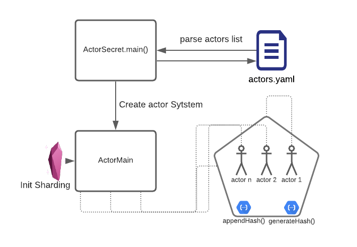

# ActorSecret

This project is created by Arvind Gupta and Sushen Kumar for CS554 at the University of Illinois at Chicago, Fall 2021

### Overview

ActorSecret uses AKKA actors to securely create passwords for applications, by passing generating the hash and communicating between actors. The input to the application is a .yaml file located in /resources

### Description

Please refer the flowchart below for a step-by-step walkthrough.

 

 - ActorSecret.main():
    The list of actors is scraped from actors.yaml. Actors are created dynamically with entityIDs and messages from the imported configuration. The actor system is initialised to distribute actors in the cluster.

 - ActorMain():
    The main actor that initiates the hashing process and creates additional hashers(actors) for the application. Cluster sharding is initialised here. 

 - Functions:
    The actors can perform two commands, generateHash() and appendToHash(). generateHash() creates a new hash based on the message and entityID, whereas appendToHash() appends to the existing hash created by the previous actor, securely creating a longer password.

